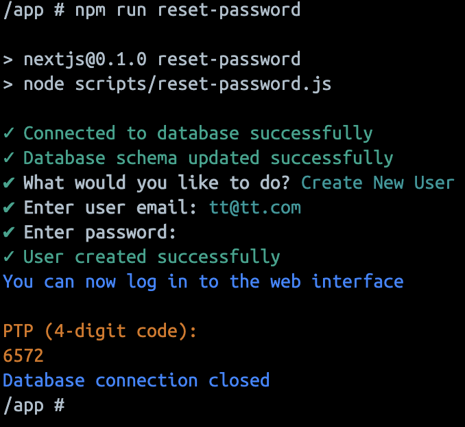

# 🎯 Very Simple Attendance System

[](LICENSE)
[](https://www.docker.com/)
[](https://nextjs.org/)
[](https://vercel.com/new/clone?repository-url=https%3A%2F%2Fgithub.com%2Frakshitbharat%2Fvery-simple-attendance)

## 📖 About

Very Simple Attendance System is a modern, Docker-based attendance tracking solution that combines security with simplicity. Built for organizations that need reliable attendance tracking with device-specific verification.

### Why Choose This System?

- 🔐 **Enhanced Security**: Unique PTP (Personal Token Pin) system for device verification
- ⚡ **Real-time Tracking**: Instant clock in/out with live updates
- 🌟 **User-Friendly**: Clean, intuitive interface for both admins and users
- 🔄 **Flexible Management**: Comprehensive admin controls for user management
- 📊 **Rich Analytics**: Detailed attendance reports and statistics
- 🐳 **Easy Deployment**: Simple Docker-based setup

## 🚀 Quick Start

### One-Click Setup

```bash
# Clone the repository
git clone https://github.com/rakshitbharat/very-simple-attendance.git

# Navigate to project directory
cd very-simple-attendance/source

# Launch with Docker
docker-compose up -d
```

Access your system at `http://localhost:3000`

Default Admin Credentials:

```
Email: admin@admin.com
Password: [Contact System Provider]
```

## 💫 Features Showcase

### 🔐 Authentication & Login


### 👥 User Management

<div align="center">
  
  <p><em>Admin Dashboard Overview</em></p>
</div>

<div align="center">
  
  <p><em>User Management Interface</em></p>
</div>

**Administrative Controls:**

<div style="display: flex; justify-content: space-between; margin: 20px 0;">
  
  
</div>
<div align="center">
  
</div>

### ⏰ Attendance Tracking

<div align="center">
  
  <p><em>User Dashboard</em></p>
  
  
  <p><em>Clock In/Out Interface</em></p>
</div>

### 🔒 PTP Security System

<div align="center">
  
  <p><em>PTP Information Screen</em></p>
  
  
  <p><em>PTP Verification Process</em></p>
  
  
  <p><em>PTP Reset Function</em></p>
</div>

## 📱 Interface Tour

### Admin Dashboard

<div align="center">
  
</div>

- Active users monitoring
- Total check-ins tracking
- Weekly attendance overview
- User management tools
- PTP management system

### User Dashboard

<div align="center">
  
</div>

- Current work status
- Today's hours tracking
- Weekly summary
- Monthly attendance calendar
- Personal activity log

## 🛠️ Technical Stack

- **Frontend**: Next.js 14
- **Backend**: Next.js API Routes
- **Database**: MySQL
- **Containerization**: Docker & Docker Compose
- **Authentication**: Custom PTP System

## 🖥️ CLI Operations

### Password Management

The system provides command-line tools for user management and password operations:

```bash
# Reset user password
npm run reset-password

# This will:
# 1. Show all current users
# 2. Allow you to select a user
# 3. Let you set a new password
# 4. Provide a PTP code for verification
```

<div align="center">
  
  <p><em>Password Reset via CLI</em></p>
</div>

### User Management

```bash
# Create new user
npm run reset-password
# Select "Create New User" option
# Follow the prompts to enter email and password
```

<div align="center">
  
  <p><em>User Creation via CLI</em></p>
</div>

### CLI Features:

- 👤 List all current users
- 🔑 Reset user passwords
- ➕ Create new users
- 🔐 Automatic PTP code generation
- 📊 Direct database interaction
- ⚡ Quick administrative actions

> Note: CLI operations require direct access to the application server and appropriate permissions.

## 📋 User Guides

### For Administrators

1. **User Management**

   - Add new users
   - Assign roles
   - Manage PTPs
   - Monitor attendance

2. **System Controls**
   - Reset user PTPs
   - Manage devices
   - Generate reports
   - Configure settings

### For Regular Users

1. **First-Time Setup**

   - Login with provided credentials
   - Enter PTP code
   - Register device

2. **Daily Usage**
   - Quick clock in/out
   - View attendance history
   - Check work hours
   - Monitor attendance streak

## ⚙️ Configuration

### Environment Setup

```env
DB_HOST=localhost
DB_PORT=3306
DB_USER=root
DB_PASS=password
```

### Docker Configuration

```yaml
version: "3.8"
services:
  app:
    build: .
    ports:
      - "3000:3000"
```

## 🆘 Troubleshooting

Common solutions for:

- Device verification issues
- PTP reset procedures
- Login problems
- Docker deployment challenges

## 🤝 Support

Need help? We're here for you:

1. Check the troubleshooting guide
2. Contact system administrator
3. Submit an issue on GitHub
4. Email support team

## 📜 License

This project is licensed under the MIT License - see the [LICENSE](LICENSE) file for details.

---

<div align="center">
  <h3>🌟 Secure Attendance Tracking Made Simple 🌟</h3>
  
  Built with ❤️ for modern organizations
</div>
